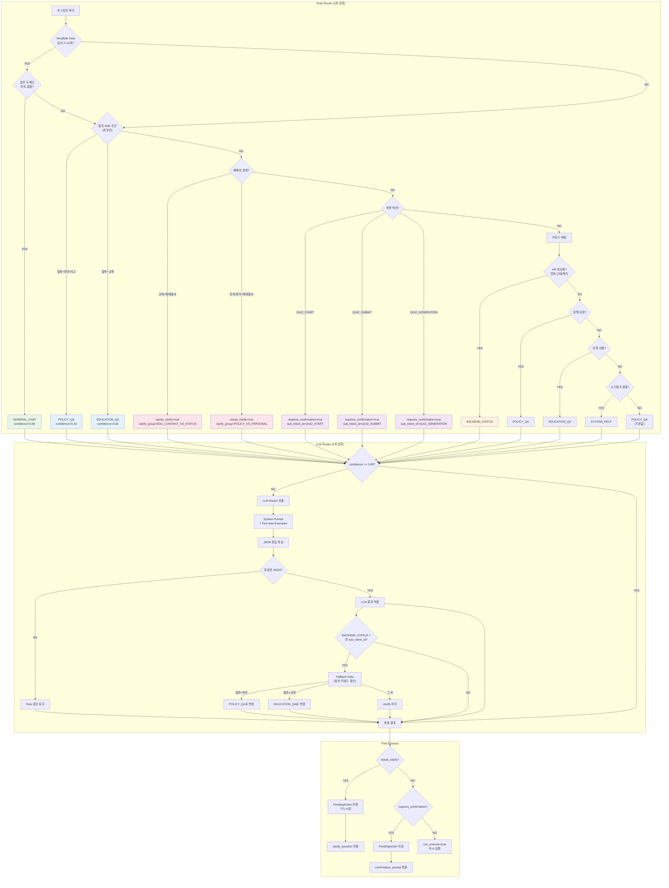
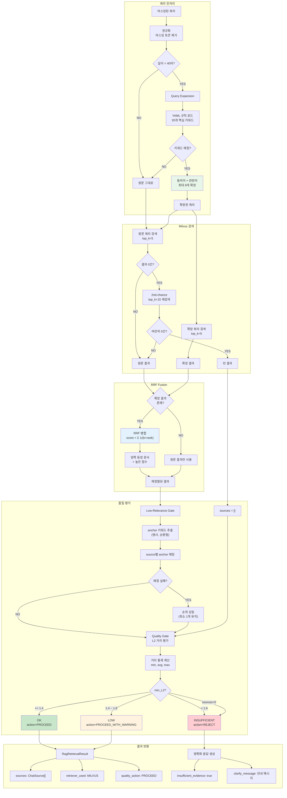
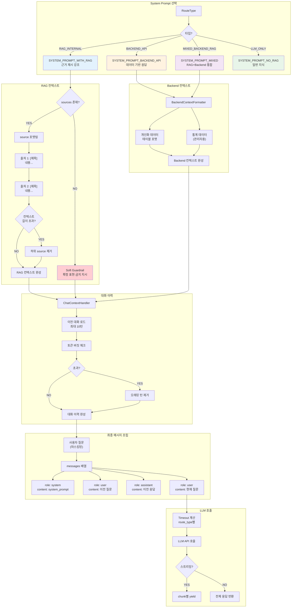
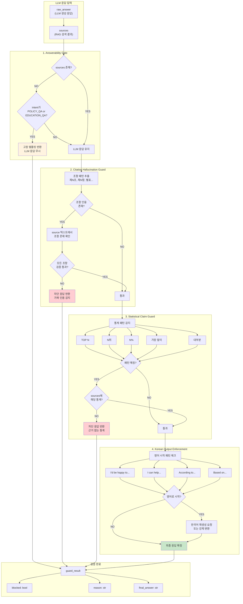
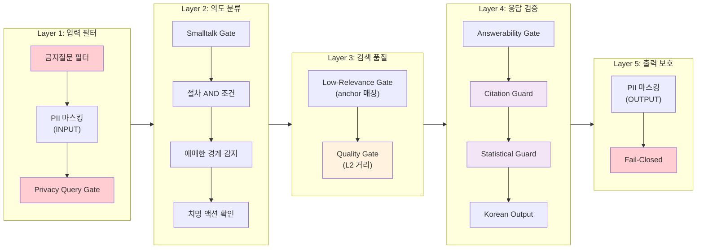
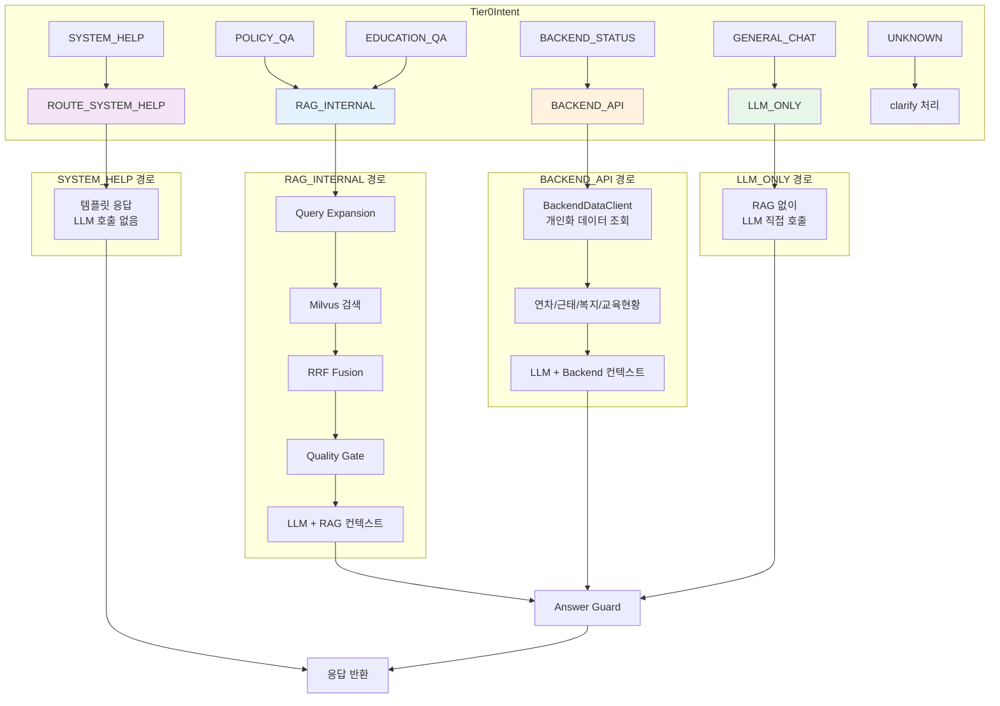
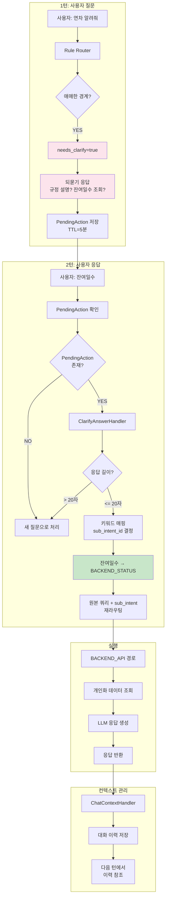

# Ctrl+F AI 시스템 전체 플로우 다이어그램

## 1. 메인 플로우 (End-to-End)

```mermaid
flowchart TD
    subgraph INPUT["1. 입력 처리"]
        A["사용자 질문"] --> B["요청 컨텍스트 초기화<br/>request_id, session_id"]
        B --> C{"금지질문 필터<br/>(ForbiddenQueryFilter)"}
        C -->|"FORBIDDEN_BOTH"| C1["차단 응답 반환"]
        C -->|"FORBIDDEN_RAG"| C2["RAG 스킵 플래그"]
        C -->|"FORBIDDEN_BACKEND"| C3["Backend 스킵 플래그"]
        C -->|"ALLOWED"| D["PII 마스킹<br/>(INPUT 단계)"]
        C2 --> D
        C3 --> D
    end

    subgraph PRIVACY["2. 프라이버시 게이트"]
        D --> E{"Privacy Query Gate<br/>명단 요청 감지"}
        E -->|"타인+명단+민감속성"| E1["차단 응답 반환"]
        E -->|"1인칭 or 허용"| F["라우팅 오케스트레이션"]
    end

    subgraph ROUTING["3. 의도 분류 & 라우팅"]
        F --> G["Rule Router<br/>(키워드 기반 1차)"]
        G --> G1["Smalltalk Gate"]
        G --> G2["절차 AND 조건"]
        G --> G3["애매한 경계 감지"]
        G --> G4["치명 액션 확인"]
        G --> G5["키워드 매칭"]

        G1 & G2 & G3 & G4 & G5 --> H{"confidence >= 0.85?"}
        H -->|"YES"| I["Rule 결과 확정"]
        H -->|"NO"| J["LLM Router<br/>(LLM 기반 2차)"]
        J --> I

        I --> K{"needs_clarify?"}
        K -->|"YES"| K1["되묻기 응답<br/>PendingAction 저장"]
        K -->|"NO"| L{"requires_confirmation?"}
        L -->|"YES"| L1["확인 요청<br/>PendingAction 저장"]
        L -->|"NO"| M["라우트 실행"]
    end

    subgraph EXECUTION["4. 라우트 실행"]
        M --> N{"RouteType?"}
        N -->|"RAG_INTERNAL"| O["RAG 검색<br/>(Policy/Education QA)"]
        N -->|"BACKEND_API"| P["Backend 조회<br/>(개인화 데이터)"]
        N -->|"MIXED_BACKEND_RAG"| Q["RAG + Backend<br/>(병렬 조회)"]
        N -->|"LLM_ONLY"| R["LLM 직접 호출<br/>(일반 대화)"]
        N -->|"ROUTE_SYSTEM_HELP"| S["시스템 도움말<br/>(템플릿)"]
    end

    subgraph RAG["5. RAG 파이프라인"]
        O --> O1["Query 정규화"]
        O1 --> O2["Query Expansion<br/>(YAML 규칙 기반)"]
        O2 --> O3["Milvus 검색<br/>(원문 쿼리)"]
        O3 --> O4{"결과 0건?"}
        O4 -->|"YES"| O5["2nd-chance<br/>top_k=15 재검색"]
        O4 -->|"NO"| O6["RRF Fusion"]
        O5 --> O6
        O6 --> O7["Low-Relevance Gate<br/>(anchor 키워드)"]
        O7 --> O8["Quality Gate<br/>(L2 거리 평가)"]
        O8 --> O9{"Quality Action?"}
        O9 -->|"REJECT"| O10["INSUFFICIENT<br/>명확화 응답"]
        O9 -->|"PROCEED"| T["LLM 프롬프트 구성"]
        O9 -->|"PROCEED_WITH_WARNING"| T
    end

    P --> T
    Q --> T
    R --> T
    S --> T

    subgraph LLM["6. LLM 처리"]
        T --> T1["System Prompt<br/>(route type별)"]
        T1 --> T2["RAG/Backend<br/>컨텍스트 추가"]
        T2 --> T3["대화 이력<br/>(멀티턴)"]
        T3 --> T4["사용자 질문"]
        T4 --> U["LLM 호출<br/>(Timeout 정책)"]
        U --> U1{"성공?"}
        U1 -->|"NO"| U2["에러 응답"]
        U1 -->|"YES"| V["Answer Guard"]
    end

    subgraph GUARD["7. 응답 검증"]
        V --> V1["Answerability Gate<br/>(RAG 근거 확인)"]
        V1 --> V2["Citation Guard<br/>(가짜 조항 검증)"]
        V2 --> V3["Statistical Guard<br/>(통계 주장 검증)"]
        V3 --> V4["Korean Output<br/>(한국어 검증)"]
    end

    subgraph OUTPUT["8. 출력 처리"]
        V4 --> W["PII 마스킹<br/>(OUTPUT 단계)"]
        W --> X["응답 조립<br/>answer + sources + meta"]
        X --> Y["AI 로그 생성<br/>(백그라운드)"]
        Y --> Z["ChatResponse 반환"]
    end

    C1 --> Z
    E1 --> Z
    K1 --> Z
    L1 --> Z
    O10 --> Z
    U2 --> Z

    style A fill:#e3f2fd
    style Z fill:#c8e6c9
    style C1 fill:#ffcdd2
    style E1 fill:#ffcdd2
    style O10 fill:#fff3e0
    style U2 fill:#ffcdd2
```

---

## 2. 라우팅 오케스트레이션 상세

---

## 3. RAG 파이프라인 상세

---

## 4. LLM 프롬프트 구성 상세

---

## 5. Answer Guard 상세

---

## 6. PII 마스킹 플로우

```mermaid
flowchart TD
    subgraph INPUT_STAGE["INPUT 단계"]
        A["사용자 질문<br/>(원문)"] --> B["PII 서비스 호출<br/>POST /mask"]
        B --> C{"서비스 정상?"}
        C -->|"YES"| D["PII 검출 & 마스킹"]
        C -->|"NO"| E["Fail-Closed 발동"]

        D --> D1["이름 → [NAME]"]
        D --> D2["전화번호 → [PHONE]"]
        D --> D3["이메일 → [EMAIL]"]
        D --> D4["주민번호 → [RRN]"]

        D1 & D2 & D3 & D4 --> F["마스킹된 쿼리"]
        E --> G["안전 메시지 반환<br/>원문 전송 차단"]
    end

    subgraph OUTPUT_STAGE["OUTPUT 단계"]
        H["LLM 응답<br/>(원문)"] --> I["PII 서비스 호출<br/>POST /mask"]
        I --> J{"서비스 정상?"}
        J -->|"YES"| K["PII 검출 & 마스킹"]
        J -->|"NO"| L["Fail-Closed 발동"]

        K --> K1["응답 내 PII 마스킹"]
        K1 --> M["마스킹된 응답"]
        L --> N["안전 메시지 반환<br/>원문 전송 차단"]
    end

    subgraph LOG_STAGE["LOG 단계"]
        O["질문 + 응답"] --> P["PII 서비스 호출<br/>stage=LOG"]
        P --> Q["마스킹된 Q&A"]
        Q --> R["Elasticsearch<br/>마스킹된 데이터만 저장"]
    end

    subgraph PRIVACY_GATE["Privacy Query Gate"]
        S["마스킹된 쿼리"] --> T["조합 규칙 체크"]
        T --> T1["대상: 직원, 팀원, 누가<br/>(+2점)"]
        T --> T2["행위: 명단, 리스트, 뽑아<br/>(+3점)"]
        T --> T3["속성: 교육, 점수, 평가<br/>(+3점)"]

        T1 & T2 & T3 --> U{"총점 >= 6?"}
        U -->|"YES"| V["BLOCK_PII_LIST<br/>차단 응답"]
        U -->|"NO"| W{"1인칭?<br/>내/저"}
        W -->|"YES"| X["ALLOW<br/>개인화 조회 허용"]
        W -->|"NO"| X
    end

    style E fill:#ffcdd2
    style G fill:#ffcdd2
    style L fill:#ffcdd2
    style N fill:#ffcdd2
    style V fill:#ffcdd2
    style F fill:#c8e6c9
    style M fill:#c8e6c9
    style X fill:#c8e6c9
```

---

## 7. 전체 보안 게이트 요약

---

## 8. RouteType별 처리 경로

---

## 9. 멀티턴 대화 플로우

---

## 파일 경로 참조

| 컴포넌트 | 파일 경로 |
|----------|-----------|
| ChatService | `app/services/chat_service.py` |
| RouterOrchestrator | `app/services/router_orchestrator.py` |
| RuleRouter | `app/services/rule_router.py` |
| LLMRouter | `app/services/llm_router.py` |
| IntentService | `app/services/intent_service.py` |
| RagHandler | `app/services/chat/rag_handler.py` |
| QueryRewriter | `app/services/chat/query_rewriter.py` |
| SearchMerger (RRF) | `app/services/search_merger.py` |
| QualityGate | `app/services/chat/quality_gate.py` |
| AnswerGuardService | `app/services/answer_guard_service.py` |
| PIIService | `app/services/pii_service.py` |
| PrivacyQueryGate | `app/services/privacy_query_gate.py` |
| MessageBuilder | `app/services/chat/message_builder.py` |
| BackendDataClient | `app/services/backend_data_client.py` |
