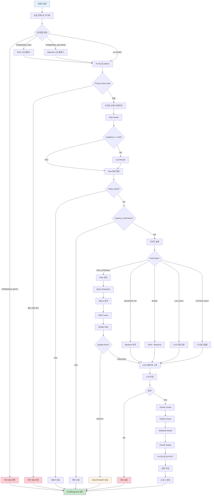
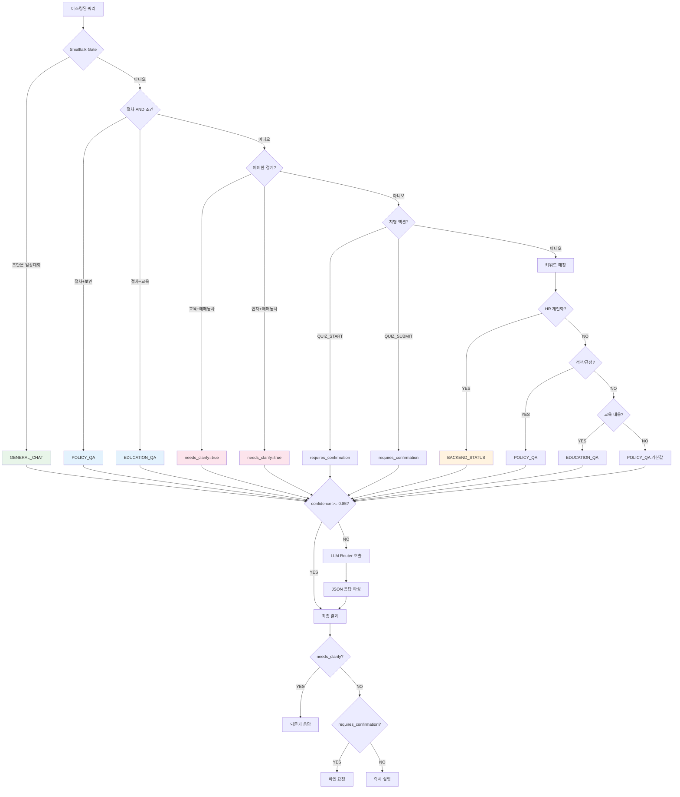
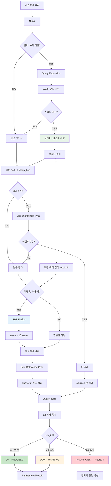
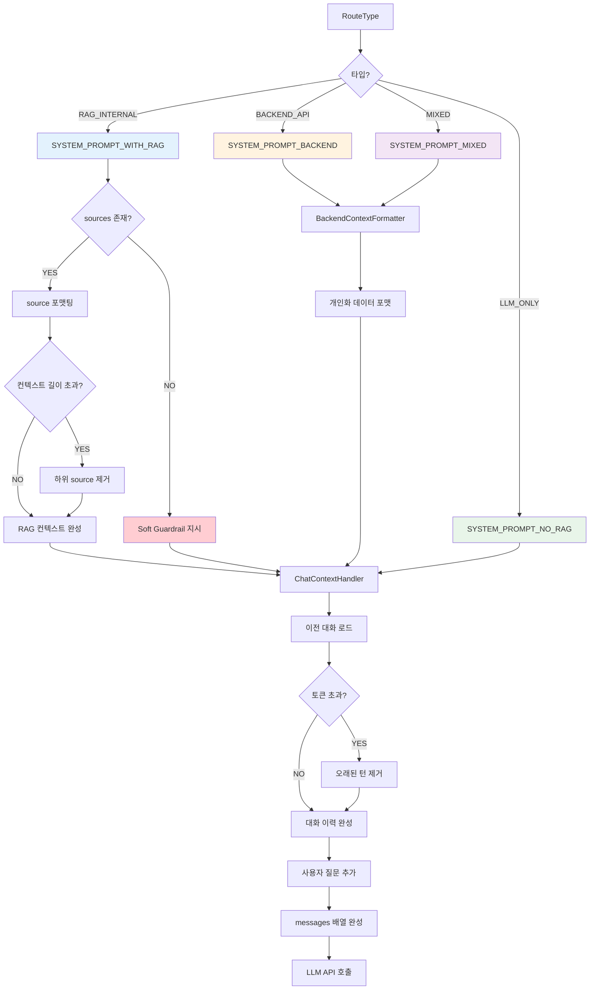
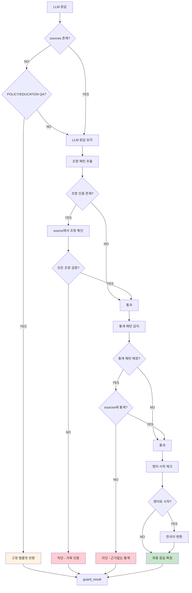
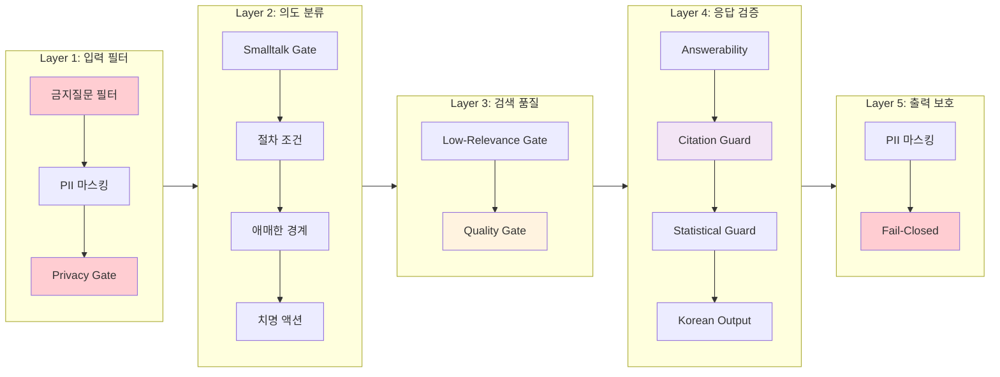
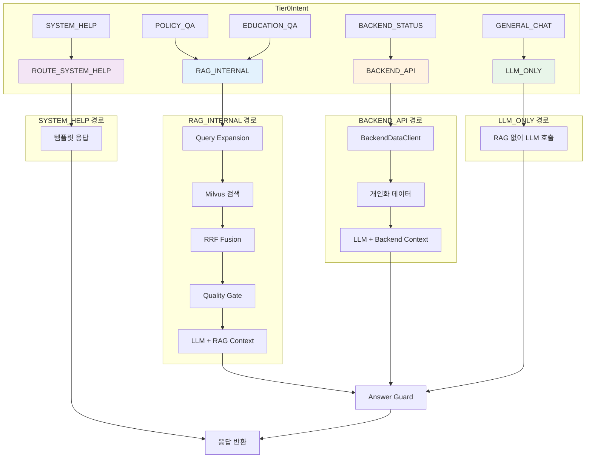
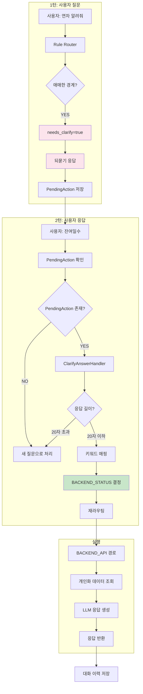

# Ctrl+F AI 시스템 전체 플로우 다이어그램

> Mermaid Live Editor에서 렌더링 테스트 완료: https://mermaid.live

---

## 1. 메인 플로우 (End-to-End)

---

## 2. 라우팅 오케스트레이션 상세

---

## 3. RAG 파이프라인 상세

---

## 4. LLM 프롬프트 구성 상세

---

## 5. Answer Guard 상세

---

## 6. PII 마스킹 플로우

```mermaid
flowchart TD
    subgraph INPUT[INPUT 단계]
        A[사용자 질문 원문] --> B[PII 서비스 호출]
        B --> C{서비스 정상?}
        C -->|YES| D[PII 검출 마스킹]
        C -->|NO| E[Fail-Closed 발동]
        D --> F[마스킹된 쿼리]
        E --> G[안전 메시지 반환]
    end

    subgraph OUTPUT[OUTPUT 단계]
        H[LLM 응답 원문] --> I[PII 서비스 호출]
        I --> J{서비스 정상?}
        J -->|YES| K[PII 검출 마스킹]
        J -->|NO| L[Fail-Closed 발동]
        K --> M[마스킹된 응답]
        L --> N[안전 메시지 반환]
    end

    subgraph LOG[LOG 단계]
        O[질문 + 응답] --> P[PII 마스킹]
        P --> Q[Elasticsearch 저장]
    end

    subgraph PRIVACY[Privacy Query Gate]
        R[마스킹된 쿼리] --> S[조합 규칙 체크]
        S --> T{총점 6점 이상?}
        T -->|YES| U[BLOCK 차단]
        T -->|NO| V[ALLOW 허용]
    end

    style E fill:#ffcdd2
    style G fill:#ffcdd2
    style L fill:#ffcdd2
    style N fill:#ffcdd2
    style U fill:#ffcdd2
    style F fill:#c8e6c9
    style M fill:#c8e6c9
    style V fill:#c8e6c9
```

---

## 7. 전체 보안 게이트 요약

---

## 8. RouteType별 처리 경로

---

## 9. 멀티턴 대화 플로우

---

## 렌더링 테스트 방법

1. **Mermaid Live Editor**: https://mermaid.live
   - 위 코드 블록 내용을 복사해서 붙여넣기

2. **VS Code**: Mermaid 확장 설치
   - `Markdown Preview Mermaid Support` 확장

3. **GitHub**: `.md` 파일 푸시 시 자동 렌더링

4. **Notion**: `/code` 블록에서 Mermaid 선택

---

## 파일 경로 참조

| 컴포넌트 | 파일 경로 |
|----------|-----------|
| ChatService | `app/services/chat_service.py` |
| RouterOrchestrator | `app/services/router_orchestrator.py` |
| RuleRouter | `app/services/rule_router.py` |
| LLMRouter | `app/services/llm_router.py` |
| RagHandler | `app/services/chat/rag_handler.py` |
| QueryRewriter | `app/services/chat/query_rewriter.py` |
| SearchMerger | `app/services/search_merger.py` |
| QualityGate | `app/services/chat/quality_gate.py` |
| AnswerGuardService | `app/services/answer_guard_service.py` |
| PIIService | `app/services/pii_service.py` |
| PrivacyQueryGate | `app/services/privacy_query_gate.py` |
